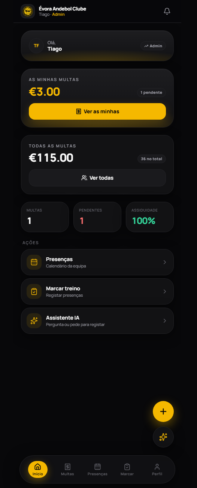
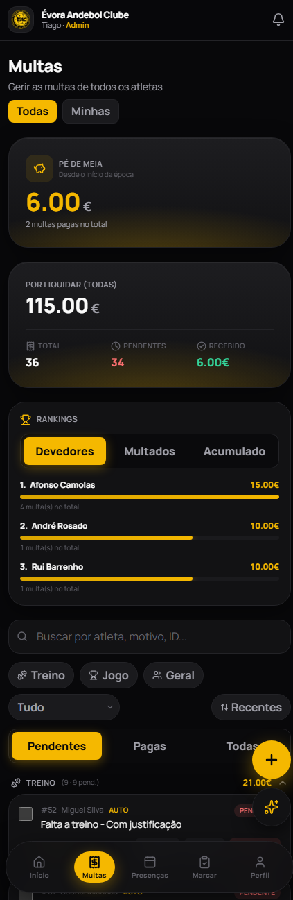
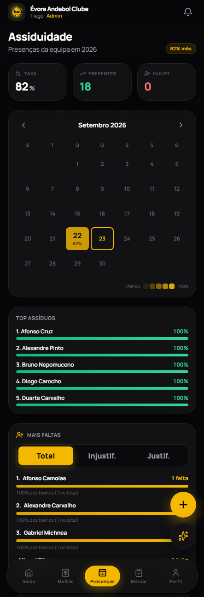
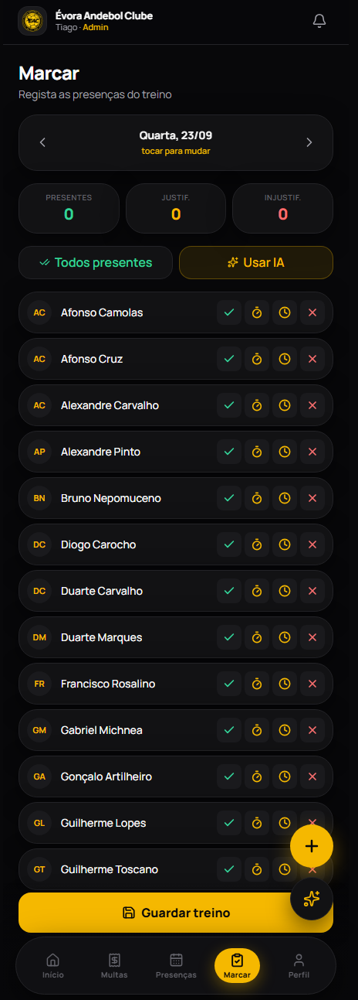
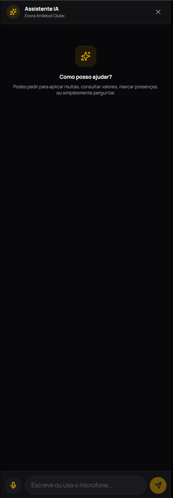
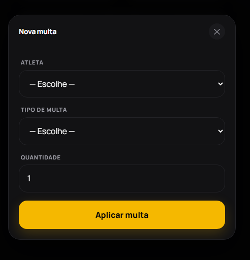

<div align="center">

# 🏐 Évora Andebol Clube — App

**App de gestão de multas e assiduidade para o Évora Andebol Clube.**

[](https://react.dev)
[](https://www.typescriptlang.org)
[](https://fastapi.tiangolo.com)
[](https://langchain-ai.github.io/langgraph/)
[](https://web.dev/progressive-web-apps/)

[Demo](https://evora-andebol.netlify.app) · [API](https://evora-andebol-api.onrender.com/docs) · [Reportar problema](https://github.com/tiago-filipe-git/EAC-app/issues)

</div>

---

## 📖 Sobre o projeto

O **EAC App** é uma aplicação interna para o **Évora Andebol Clube** que permite:

- 💰 **Gerir multas** — aplicar, editar, marcar como pago, apagar em massa
- 📋 **Marcar presenças** — treinos, atrasos, faltas justificadas e injustificadas
- 📊 **Consultar estatísticas** — rankings de assiduidade, evolução mensal, top devedores
- 🤖 **Interagir com IA** — aplicar multas, marcar presenças ou consultar dados através de linguagem natural
- 📱 **Instalar como app** — funciona como PWA em Android, iOS e desktop

A app foi desenhada a pensar no **dia a dia do clube**: rápido de usar no telemóvel, com automações que poupam tempo à equipa técnica e ao sindicato.

---

## ✨ Funcionalidades

### Gestão de Multas
- 31 tipos de multa baseados no regulamento oficial (treino, jogo, gerais)
- Cálculo automático de valores (fixo, por minuto, por peça, progressivo)
- Multas automáticas por falta injustificada ou atraso
- Atraso de pagamento (+0,50€/dia após o dia 1 do mês seguinte)
- "Pé de meia" — fundo acumulado das multas pagas
- Rankings: top devedores, top multados, top valor acumulado
- Filtros por categoria, período, estado e busca por texto

### Assiduidade
- Calendário interativo com intensidade de cor por % de presenças
- Drill-down do dia (quem esteve, quem faltou)
- Top assíduos e top faltosos
- Marcação com atraso em minutos
- Apagar treino inteiro (com backup automático)

### Assistente IA
- Chat em linguagem natural
- 25+ ferramentas (tool-calling com LangGraph)
- Contexto por role (jogador, equipa técnica, sindicato, admin)
- Comandos compostos: *"marca o treino de hoje: todos presentes menos o Zé, e aplica-lhe multa por falta injustificada"*

### Gestão de Users
- Registo público (novos users ficam como jogador)
- Admin atribui roles (sindicato, equipa técnica, admin)
- Apagar users com cascata nos dados + backup automático

---

## 📸 Screenshots

<div align="center">

| Dashboard | Multas | Presenças |
|---|---|---|
|  |  |  |

| Marcar treino | Assistente IA | Nova multa |
|---|---|---|
|  |  |  |

</div>

---

## 🏗️ Arquitetura
┌──────────────────────┐
│ Frontend (Netlify) │ React + TypeScript + Tailwind + PWA
│ evora-andebol │
│ .netlify.app │
└──────────┬───────────┘
│ HTTPS + JWT
▼
┌──────────────────────┐
│ Backend (Render) │ FastAPI + SQLModel + LangGraph
│ evora-andebol-api │
│ .onrender.com │
└──────────┬───────────┘
│
├──► 🗄️ Turso (SQLite distribuído)
└──► 🤖 Groq (LLM)
### Stack técnico

**Frontend:**
- React 19 + TypeScript + Vite
- Tailwind CSS 4
- React Router
- Axios + SSE (para o chat em streaming)
- PWA (instalável em Android, iOS e desktop)
- Lucide Icons

**Backend:**
- FastAPI + Uvicorn
- SQLModel (SQLAlchemy + Pydantic)
- JWT (python-jose) + bcrypt
- LangGraph + LangChain (tool-calling)
- Groq (LLM `openai/gpt-oss-120b`)

**Infra:**
- Frontend → Netlify
- Backend → Render
- Base de dados → Turso
- Código → GitHub

---

## 📂 Estrutura do projeto
EAC-app/
├── projeto-rag/ # Backend (FastAPI)
│ ├── app/
│ │ ├── api/ # Endpoints HTTP
│ │ ├── services/ # Lógica de negócio
│ │ ├── db/ # Modelos e database
│ │ ├── core/ # Auth, permissões
│ │ ├── graph/ # LangGraph + tools
│ │ └── main.py
│ ├── qa/ # Testes manuais e scripts
│ └── requirements.txt
│
├── evora-andebol-app/ # Frontend (React)
│ ├── src/
│ │ ├── pages/ # Ecrãs
│ │ ├── components/ # Componentes reutilizáveis
│ │ ├── context/ # AuthContext
│ │ ├── lib/ # API client, helpers
│ │ └── main.tsx
│ ├── public/
│ └── vite.config.ts
│
├── docs/
│ └── screenshots/ # Imagens do README
│
├── start_all.cmd # Arrancar tudo (Windows)
├── start_backend.cmd
└── start_frontend.cmd
---

## 🚀 Como correr localmente

### Pré-requisitos
- Python 3.12+
- Node.js 20+
- Chave de API do [Groq](https://console.groq.com/keys)
- (Opcional) Conta [Turso](https://turso.tech) para DB em cloud

### Backend

```bash
cd projeto-rag

# Criar e ativar venv
python -m venv venv
venv\Scripts\activate    # Windows
# source venv/bin/activate  # macOS/Linux

# Instalar dependências
pip install -r requirements.txt

# Configurar variáveis de ambiente
cp .env.example .env
# Editar .env e preencher GROQ_API_KEY

# Correr
uvicorn app.main:app --reload
Backend fica em http://127.0.0.1:8000 (Swagger em /docs).
cd evora-andebol-app
npm install
npm run dev
Frontend fica em http://localhost:5173.
cd projeto-rag
python -m app.db.seed
Cria o user admin e os 31 tipos de multa.

🔐 Autenticação
Login por username ou telefone

JWT com expiração de 1 semana

Roles: jogador, equipa_tecnica, sindicato, admin

Registo público cria sempre com role=jogador

🤖 Como funciona a IA
A app usa LangGraph para orquestrar um agente com tool-calling. O utilizador escreve em linguagem natural e o LLM decide quais funções chamar.
"aplica multa por falta injustificada ao Zé Atleta"
"marca o treino de hoje: todos presentes menos o Zé"
"quantas multas pendentes tem o Pedro?"
"apaga o treino de 22 de setembro"
"notifica os devedores que têm multas em atraso"
O agente tem acesso a 25+ tools que cobrem multas, presenças, notificações e users. As permissões são validadas por role.
📱 Instalar como app
Android
Abre o site no Chrome

Menu → Instalar app

iOS
Abre o site no Safari

Botão Partilhar → Adicionar ao Ecrã Principal

Ativar "Abrir como App Web"

Desktop (Chrome/Edge)
Ícone de instalar na barra de endereço
🛠️ Variáveis de ambiente
Backend (projeto-rag/.env)
Variável	Descrição
GROQ_API_KEY	Chave API do Groq (obrigatória)
SECRET_KEY	Chave para assinar JWT (obrigatória em produção)
TURSO_URL	URL da DB Turso (opcional — usa SQLite local se vazio)
TURSO_TOKEN	Token de acesso à Turso (obrigatório se TURSO_URL definido)
Frontend (evora-andebol-app/.env)
Variável	Descrição
VITE_API_URL	URL do backend (ex: https://evora-andebol-api.onrender.com)
📄 License
MIT — vê LICENSE.

Resumindo: podes usar, copiar, modificar e distribuir livremente, mesmo para fins comerciais. Só tens de manter o aviso de copyright original.

👤 Autor
Tiago Filipe

GitHub: @tiago-filipe-git

LinkedIn: https://www.linkedin.com/in/tiago-filipe-803674345/

⚠️ Aviso
Este projeto foi feito para o Évora Andebol Clube como caso prático. Não é um produto comercial nem tem suporte oficial.

Se quiseres fazer algo semelhante para a tua equipa, fica à vontade para pegar no código e adaptar.

<div align="center">
Feito com 💛 para o Évora Andebol Clube

</div> ```